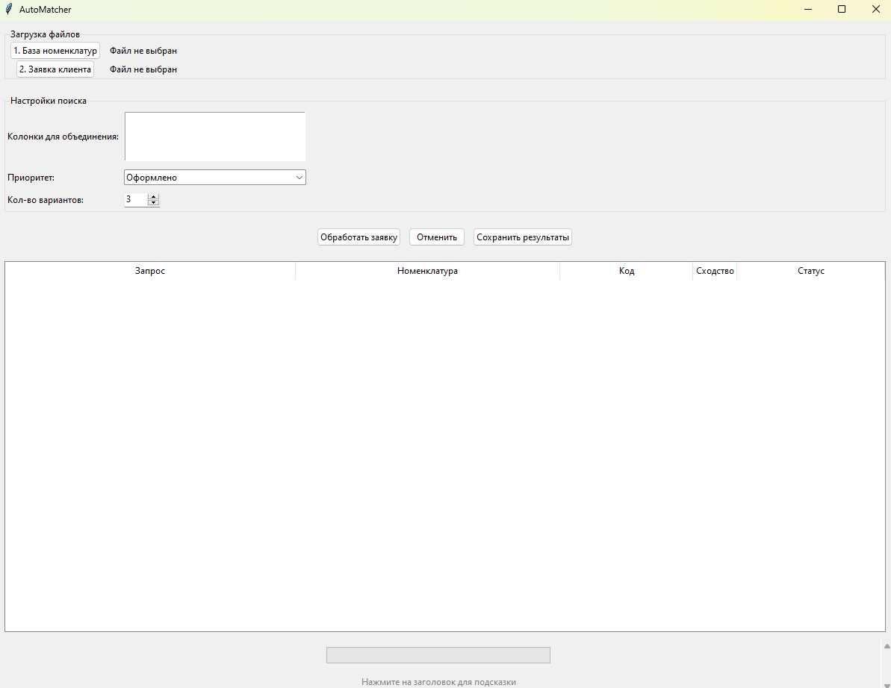

# AutoMatcher

**Приложение для автоматического сопоставления товарных позиций с использованием алгоритма BM25.**

## 📦 Зависимости
- Python 3.8+
- Библиотеки (см. `requirements.txt`)

## 🚀 Быстрый старт
1. Установите зависимости:
   ```bash
   pip install -r requirements.txt
   ```
2. Запустите приложение:
   ```bash
   python main.py
   ```

## 🔧 Требования
| Библиотека    | Версия     |
|---------------|------------|
| pandas        | >=2.2.3    |
| openpyxl      | >=3.2.0b1  |
| rank-bm25     | 0.2.2      |
| numpy         | >=2.2.4    |

## 📂 Примеры файлов
- `examples/nomenclature.xlsx` — шаблон базы номенклатур
- `examples/1.xlsx` — пример клиентской заявки

## 📸 Скриншоты


